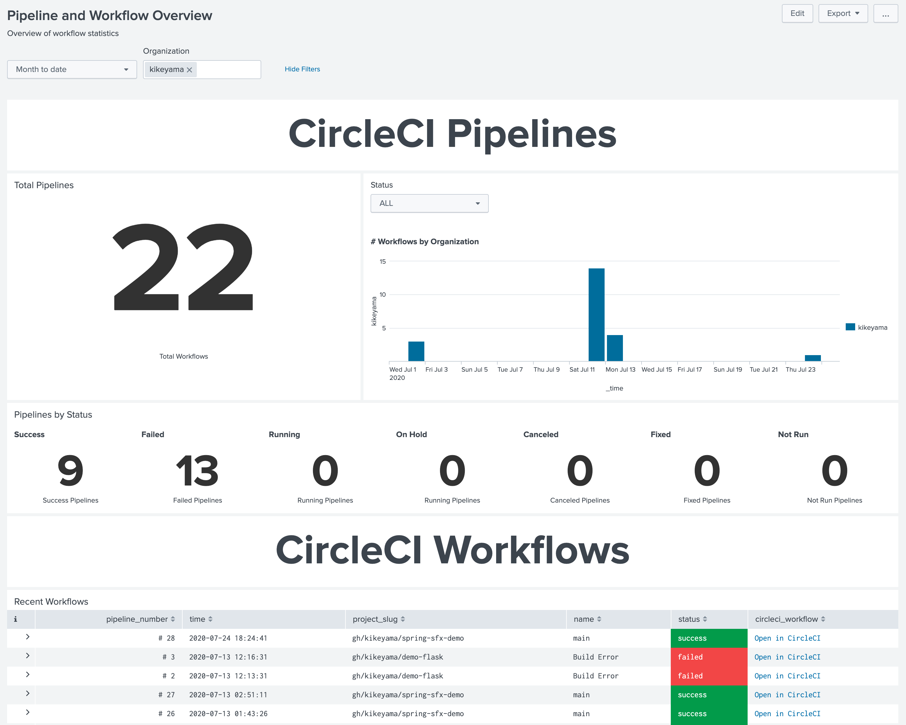

# Splunk App for CircleCI

Collect and visualize workflows, jobs, and steps data from CircleCI cloud  

## Dashboards

### CircleCI Overview

  
  
- Number of triggered pipelines by status
- Recent workflows and drilldown to jobs
- Open CircleCI console from workflows table
- Workflows by project and timechart

### CircleCI Insights

- Status statistics by project
- Pipeline trigger types
- Triggered users
- Failure analysis and MTTR
- Build performance statistics

### CircleCI Monitor

  
  
- Workflow monitor
- Event notification from [orb](https://circleci.com/orbs/registry/orb/kikeyama/splunk)
- Workflow details and drilldown to jobs and steps
- Open CircleCI console (workflow and job)

## Data

Source Types | Description | Data source
-------------|-------------|------------
`circleci:workflow` | Default sourcetype of CircleCI workflows | Modular Input
`circleci:job` | Default sourcetype of CircleCI jobs | Modular Input
`circleci:step` | Default sourcetype of CircleCI steps | Modular Input
`circleci:workflow:event` | Default sourcetype of CircleCI workflow [orb](https://circleci.com/orbs/registry/orb/kikeyama/splunk) | HTTP Event Collector
`circleci:build:event` | Default sourcetype of CircleCI job [orb](https://circleci.com/orbs/registry/orb/kikeyama/splunk) | HTTP Event Collector

## How to setup

### 1. Install this app into your Splunk

#### Splunk single instance

1. Clone or download this repository at `$SPLUNK_HOME/etc/apps` (`$SPLUNK_HOME` is the directory where you installed Splunk)
2. Rename the repo directory to `circleci`

#### Splunk distributed or cluster

1. Install and setup Heavy Forwarder in any host (EC2 instance, your baremetal server, or VM, etc)
2. Clone or download then rename the directory this repo at Search Heads, Indexers, and Heavy Forwarder 


### 2. Get your API Token at CircleCI

1. Access your CircleCI [user settings](https://app.circleci.com/settings/user/tokens) and `Create New Token`
2. Copy your API token

### 3. Create Data Inputs at Splunk

1. `Settings` > `Data Inputs` then click `CircleCI Builds`
2. Click `New` and input settings as following 

Field | Description | Default
------|-------------|--------
`name` | Input name you prefer (can be different from CircleCI API token name) | N/A
`API Token` | API Token you copied at the previous step | N/A
`interval` | Interval (seconds) this app collects CircleCI data | 600

## Troubleshooting

### Checkpoint endpoint

To reduce overhead of API request and event writing, modular input uses KV Store to record checkpoint.  

**Workflow checkpoint:** `/servicesNS/nobody/system/storage/collections/data/_circleci_workflow_checkpoint_collection`  
**Job Checkpoint:** `/servicesNS/nobody/system/storage/collections/data/_circleci_job_checkpoint_collection`  
See [Splunk API Doc](https://docs.splunk.com/Documentation/Splunk/8.0.5/RESTREF/RESTkvstore)

If you'd like to re-index data, delete all checkpoint above.  

```
# Delete workflow checkpoints
curl -X DELETE -u <user>:<password> -k https://<splunk_hostname>:8089/servicesNS/nobody/system/storage/collections/data/_circleci_workflow_checkpoint_collection

# Delete job checkpoints
curl -X DELETE -u <user>:<password> -k https://<splunk_hostname>:8089/servicesNS/nobody/system/storage/collections/data/_circleci_job_checkpoint_collection
```

## Open issues

If you find issues or feature request, feel free to open [issues](https://github.com/kikeyama/splunk-circleci-app/issues).
